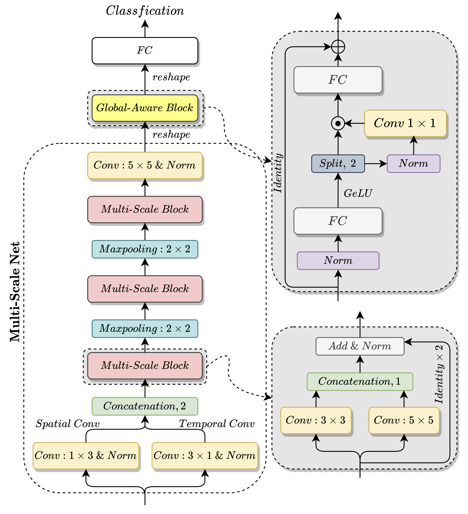
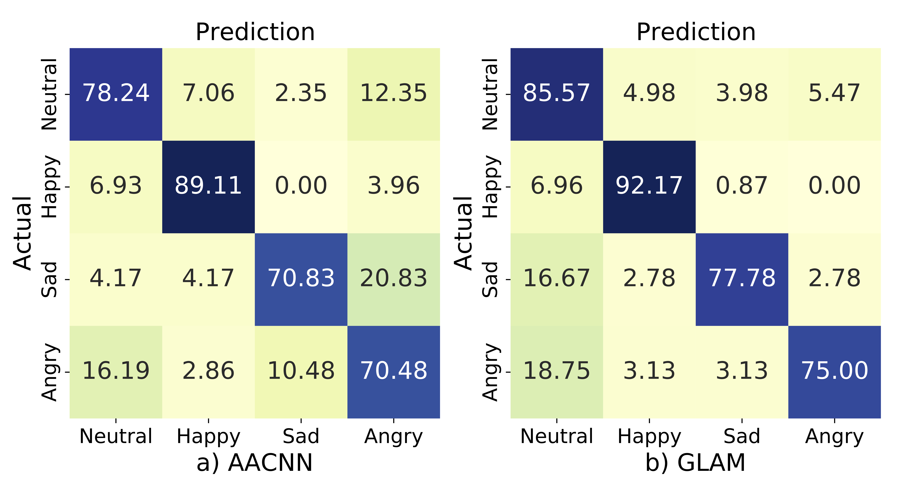
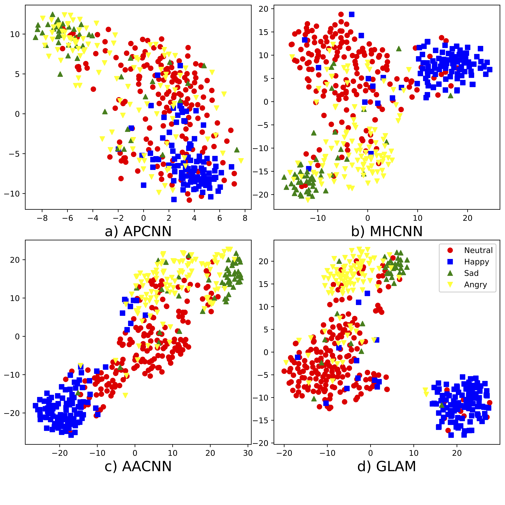

# GLAM
By Wenjing Zhu, Xiang Li. 

Du Xiaoman

## Introduction
GLobal-Aware Multi-scale (GLAM) is a novel neural network to learn multi-scale feature representation with global-aware fusion module to attend emotional information for Speech Emotion Recognition (SER).

This repository contains the implementation used for the results in our [paper](https://arxiv.org/abs/2022).



## Requirements and Installation
* Python version 3.6
* PyTorch 
* g_mlp_pytorch
* area_attention
* pytorch_model_summary

## Preprocess
1. specify path of IEMOCAP corpus in `path.py`
2. run `python handleIEMOCAP.py` to rename audio filename. 
3. run `python seeds.py` to generate seeds. 

## Training
Use python `train.py` to train a new model.

Run directly: `./run`(to make the script executable: `chmod +x run`) or `bash run`.
 
Training scripts are stored in `scripts` directory. Please move the script to root directory in this repository before execute it. 

### GLAM
- training on improvised dataset. 
    
    `./GLAM`

- training on scripted dataset. 
    
    `./GLAM_script`

- training on full dataset. 
    
    `./GLAM_all`

### MACNN
- training on improvised dataset. 
    
    `./MACNN`

- training on scripted dataset. 
    
    `./MACNN_script`

- training on full dataset. 
    
    `./MACNN_all`

### CNN + Attention pooling
- training on improvised dataset. 
    
    `./attnpooling`

- training on scripted dataset. 
    
    `./attnpooling_script`

- training on full dataset. 
    
    `./attnpooling_all`

### Ablation study
- Multi-scale
    
    `./ResMultiConv3`

- Multi-scale + MHA
    
    `./MHResMultiConv3`

- Multi-scale + AA
    
    `./AAResMultiConv3`

- MHCNN 

    `./MHCNN`

- AACNN(TF2 implementatiion) 

    see https://github.com/lessonxmk/Optimized_attention_for_SER

## Results
Confusion matrix on Improvisation dataset. a) and b) represent results of AACNN and GLAM model respectively.


Visualizations of hidden states by commonly-used t- SNE method on improvisation dataset for four models: a) APCNN; b) MHCNN; c) AACNN; d) GLAM.


Comparison of evaluation metrics on three types of datasets.
| Dataset | Model         | WA                        | UA                        | macro F1                  | micro F1                  |
|---------|---------------|---------------------------|---------------------------|---------------------------|---------------------------|
| Improvisation        | APCNN         | 70.73+/-2.57          | 67.96+/-2.66          | 68.26+/-3.17          | 70.20+/-3.00          |
| Improvisation        | MHCNN         | 76.09+/-2.01          | 73.87+/-2.31          | 74.27+/-2.25          | 75.91+/-2.05          |
| Improvisation        | AACNN         | 78.47+/-2.42          | 76.68+/-3.29          | 76.69+/-3.27          | 78.29+/-2.58          |
| Improvisation        | **GLAM** | **81.18+/-1.47** | **79.25+/-1.88** | **79.87+/-1.64** | **80.99+/-1.50** |
| Script        | APCNN         | 55.95+/-2.93          | 54.86+/-2.74          | 48.75+/-3.71          | 51.15+/-3.87          |
| Script        | MHCNN         | 64.57+/-2.12          | 63.42+/-2.14          | 61.46+/-2.50          | 63.36+/-2.56          |
| Script        | AACNN         | 67.20+/-4.78          | 65.94+/-6.19          | 64.82+/-7.63          | 66.55+/-6.99          |
| Script        | **GLAM** | **71.44+/-2.05** | **70.39+/-2.13** | **69.56+/-2.13** | **70.91+/-2.12** |
| Full        | APCNN         | 62.53+/-1.43          | 62.80+/-1.53          | 61.89+/-1.52          | 62.12+/-1.50          |
| Full        | MHCNN         | 69.80+/-1.69          | 70.09+/-1.74          | 69.65+/-1.73          | 69.68+/-1.71          |
| Full        | AACNN         | 70.94+/-5.08          | 71.04+/-4.84          | 70.59+/-6.34          | 70.71+/-6.44          |
| Full        | **GLAM** | **73.70+/-1.25** | **73.90+/-1.31** | **73.51+/-1.29** | **73.60+/-1.27** |

Performance of multi-scale module and global- aware module on Improvisation dataset.
| Model         | WA                        | UA                        | macro F1                  | micro F1                  |
|---------|---------------|---------------------------|---------------------------|---------------------------|
| **GLAM**         | **81.18+/-1.47**          | **79.25+/-1.88**          | **79.87+/-1.64**          | **80.99+/-1.50**          |
| Multi-scale | 80.89 +/- 1.43 | 78.85 +/- 1.65 | 79.47 +/- 1.60 | 80.67 +/- 1.45 |
| Multi-scale + MHA | 80.43 +/- 1.53 | 78.92 +/- 1.92 | 79.20 +/- 1.68 | 80.26 +/- 1.53 |
| Multi-scale + AA | 80.61 +/- 1.75 | 79.09 +/- 1.75 | 79.47 +/- 1.80 | 80.46 +/- 1.77
| MHCNN | 76.09 +/- 2.01 | 73.87 +/- 2.31 | 74.27 +/- 2.25 | 75.91 +/- 2.05 |
| AACNN | 78.47 +/- 2.42 | 76.68 +/- 3.29 | 76.69 +/- 3.27 | 78.29 +/- 2.58 |

Result of \(\alpha\) on Improvisation dataset.
| \(\alpha\)         | WA                        | UA                        | macro F1                  | micro F1                  |
|---------|---------------|---------------------------|---------------------------|---------------------------|
| 0 | 80.44 +/- 1.54 | 78.88 +/- 1.66 | 79.31 +/- 1.55 | 80.32 +/- 1.55 |
| 0.3 | 81.15 +/- 1.73 | 79.26 +/- 1.98 | 79.88 +/- 1.85 | 80.98 +/- 1.76 |
| **0.5**         | **81.18+/-1.47**          | **79.25+/-1.88**          | **79.87+/-1.64**          | **80.99+/-1.50**          |
| 0.8 | 80.97 +/- 1.53 | 78.97 +/- 1.85 | 79.62 +/- 1.75 | 80.79 +/- 1.53 |
| 1 | 80.96 +/- 1.72 | 79.19 +/- 1.92 | 79.65 +/- 1.88 | 80.78 +/- 1.73 |
| 2 | 80.80 +/- 1.39 | 79.18 +/- 1.66 | 79.55 +/- 1.50 | 80.64 +/- 1.40 |
| 3 | 80.61 +/- 1.45 | 78.95 +/- 1.58 | 79.26 +/- 1.59 | 80.44 +/- 1.45 |

Split the dataset into training, validation and testing sets at a ratio of 8:1:1. 
| Dataset | Model         | WA                        | UA                        | macro F1                  | micro F1                  |
|---------|---------------|---------------------------|---------------------------|---------------------------|---------------------------|
| Improvisation        | APCNN         | 69.93 +/- 4.33 | 62.70 +/- 5.16 | 63.04 +/- 5.94 | 68.86 +/- 5.48
| Improvisation        | MHCNN         | 76.13 +/- 2.80 | 71.15 +/- 4.11 | 71.91 +/- 3.92 | 75.92 +/- 2.87
| Improvisation        | AACNN | 78.65+/-3.30 | 74.31+/-4.59 | 74.78+/-4.43 | 78.47+/-3.40        | 
| Improvisation        | **GLAM** | **81.04 +/- 2.65** | **75.89 +/- 3.94** | **76.79 +/- 3.78** | **80.78 +/- 2.75** 
| Script        | APCNN         | 53.48 +/- 3.83 | 55.77 +/- 3.60 | 48.14 +/- 4.27 | 48.10 +/- 4.90
| Script        | MHCNN         | 63.03 +/- 3.52 | 64.37 +/- 3.24 | 61.32 +/- 3.88 | 61.77 +/- 4.31
| Script        | AACNN | 65.49+/-3.49 | 65.87+/-2.98 | 64.36+/-3.42 | 65.22+/-3.77       | 
| Script        | **GLAM** | **69.80 +/- 3.16** | **70.63 +/- 3.17** | **68.85 +/- 3.40** | **69.30 +/- 3.42**
| Full        | APCNN         | 60.33 +/- 2.67 | 62.16 +/- 2.55 | 60.03 +/- 2.78 | 59.67 +/- 2.88
| Full        | MHCNN         | 67.67 +/- 2.34 | 68.65 +/- 2.32 | 67.55 +/- 2.34 | 67.58 +/- 2.36
| Full        | AACNN | 67.71+/-2.25 | 68.67+/-2.22 | 67.62+/-2.32 | 67.46+/-2.33        | 
| Full        | **GLAM** | **71.63 +/- 2.12** | **72.56 +/- 2.05** | **71.53 +/- 2.16** | **71.42 +/- 2.19** |


## Citation

If you use this method or this code in your paper, then please cite it:

```
@INPROCEEDINGS{
GLAM,
title={Speech Emotion Recognition with Global-Aware Fusion on Multi-scale Feature Representation},
booktitle={Proceedings of the 2022 {IEEE} International Conference on Acoustics, Speech and Signal Processing}
author={Wenjing Zhu, Xiang Li},
publisher = {{IEEE}},
journal={ICASSP},
year={2022},
url={https://github.com/lixiangucas01/GLAM},
}
```